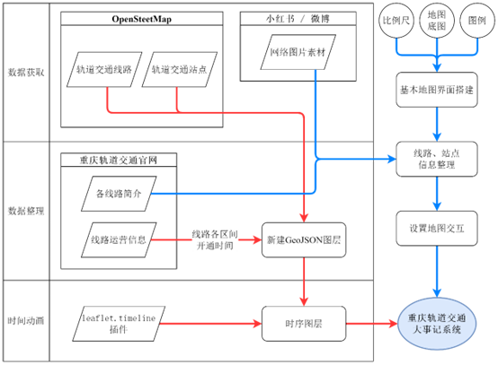
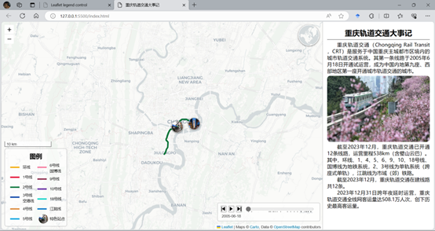
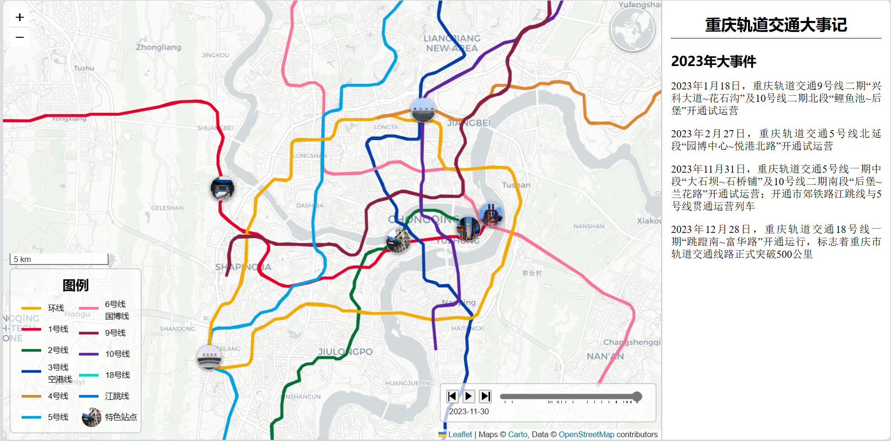
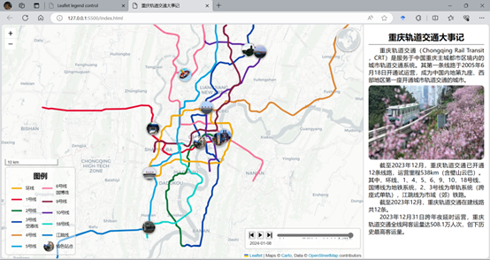
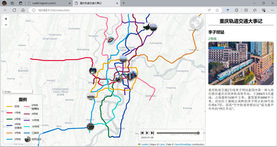
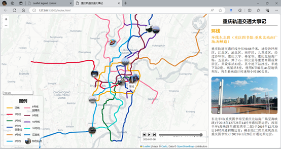
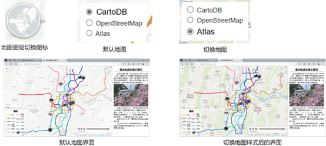
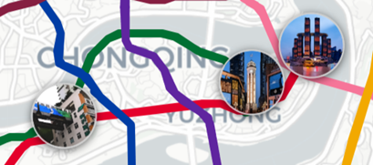
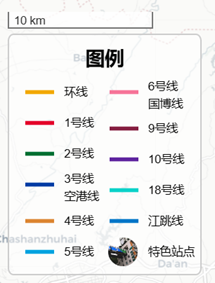
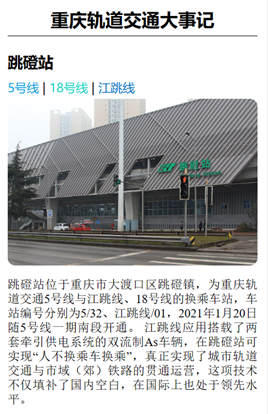

# CRT Map Events
## 引言：
> 2011年，重庆轨道交通3号线一期工程长福路至江北机场（现江北机场T2航站楼站）段开通。我于次年乘坐该条线路，第一次坐上城市轨道交通的体验让我倍感兴奋，也逐渐喜欢上了轨道交通。作为一个轨道交通爱好者，借《数字制图学》课程设计的契机，根据作业要求，我拟基于Leaflet开发一款能反应重庆轨道交通建设、运营、发展变化的地图可视化系统。

## 1. 项目介绍
>- 数据获取：OpenStreetMap（OverPass API）
>- 数据组织：GeoJSON + AJAX
>- 地图开发：Leaflet（含开源插件）

如图所示，本次开发主要分为两条技术路线。红线为核心内容，首先从[OpenSteetMap](https://openstreetmap.org)下载轨道交通线路和站点信息，并结合个人先验知识进行初步筛选与合并。然后根据重庆轨道交通官网上的公开信息，添加各条线路各个区间的时序信息，并使用`Leaflet.timeline`插件进行图层加载，实现时间动画。  
而蓝线为杂项内容，包括添加比例尺、使用`Leaflet.Legend`插件添加地图图例，从[OpenWhatEverMap网站](https://openwhatevermap.xyz/)选择多个合适的地图底图并使用`L.control.layers()`方法添加至地图便于用户切换，从官网和小红书等网站搜集素材并设置地图交互功能，监听鼠标点击事件并展示点击的站点、线路信息。



## 2. 系统展示
> 在线观看：[基于leaflet开发的重庆轨道交通大事记系统](https://www.bilibili.com/video/BV1yK411v7W3/?share_source=copy_web&vd_source=e6547485e0669245bbe15191d005cb3a)

### 2.1 系统首页

### 2.2 地图播放
> 右侧有当年的一些关键性事件


### 2.3 综合效果

### 2.4 点击站点

### 2.5 点击线路


## 3. 设计细节
### 3.1 地图图层切换

### 3.2 特色站点

### 3.3 图例和比例尺

### 3.4 站点/线路信息展示


## 附录
### 1. 核心代码
本系统的核心功能都需要在GeoJSON数据添加至图层完毕后进行。在这一部分代码中，除了读取数据的时间内容以匹配时间轴插件格式要求外，还进行了样式设置，还添加了鼠标点击和时间轴对应年份更新事件。
```js
geojsonLayerOfCrt.on('data:loaded', function (data) {
    // some code...
    // 时间轴
    let timelineControl = L.timelineSliderControl({
        formatOutput: function (date) {
            return moment(date).format("YYYY-MM-DD");
        },
        // some style code
    });
    let timeline = L.timeline(geojsonLayerOfCrt.toGeoJSON(), {
        getInterval: function (feature) {
            return {// 设置每条线路的开始时间，终止时间为最新
                start: new Date(feature.properties.time).getTime(),
                end: new Date("2024-01-08").getTime()
            };
        },
        // some other code...
    });
    // some code...
    // 时间改变事件
    timeline.on("change", function (e) {
        currentTime = this.time;
        if (currentYear == getYearFromTimestamp(currentTime)) {// 年份不变
        } else {//更新当年的大事件至HTML中
            currentYear = getYearFromTimestamp(currentTime);
            updateAnnualEvent(currentYear);
        }
    });
});
```
### 2. 数据组织
由于线路数据是从开源地图网站上获取，数据格式组织混乱，属性信息参差不齐，故以GeoJSON格式统一规范整理。
- 站点信息：
```json
{
    "type": "Feature",
    "properties": {
        "fid": 41,
        "subway": "yes",
        "network": "重庆轨道交通",
        "name": "欢乐谷",
        "monorail": null,
        "interchange": null,
        "belongto": "国博支线",
        "time": "2013-05-15",
        "url":"css/images/station/ferris-wheel.png"
    },
    "geometry": {
        "type": "Point",
        "coordinates": [
            106.xxx,
            29.xxx
        ]
    }
},
```
- 线路信息
```json
{
    "type": "Feature",
    "properties": {
        "fid": 1,
        "name": "2号线",
        "planning": null,
        "projectname": "2号线一期",
        "time": "2005-06-18",
        "color": "#007033",
        "section": "较场口-动物园"
    },
    "geometry": {
        "type": "MultiLineString",
        "coordinates": [
            [xxx,xxx],
            [xxx,xxx],
            ...
        ]
    }
}
```

## 声明
本系统中地理数据、地图底图数据来源于开源地图网站，作者不对其真实性负责。鉴于本系统采用wgs-84坐标系，根据《测绘法》等相关法律法规要求，不宜在互联网上传播，故不作在线演示，不提供`./data/重庆轨道交通线路.geojson`、`./data/特色站点.geojson`等包含坐标信息的文件，如有需要，可自行参考`附录/数据组织`一节中的相关介绍和示例。  
联系方式：xiaosuqi1778@163.com